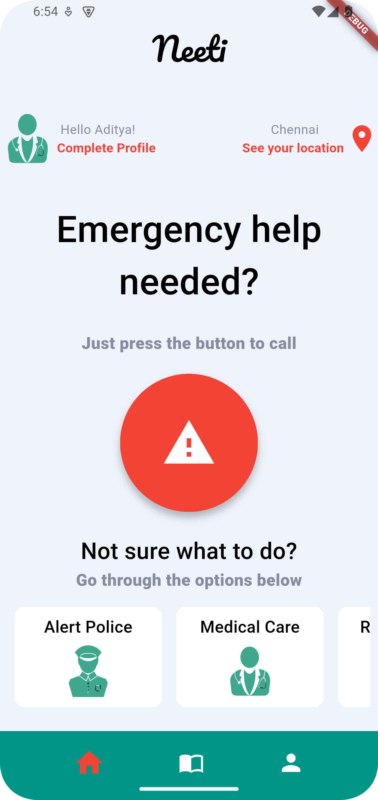
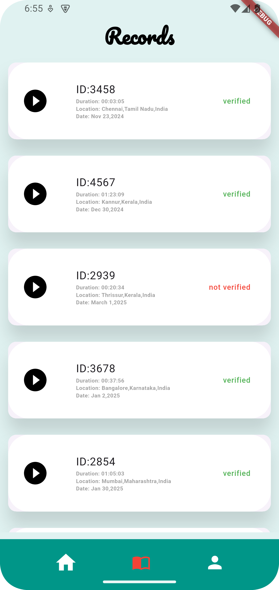
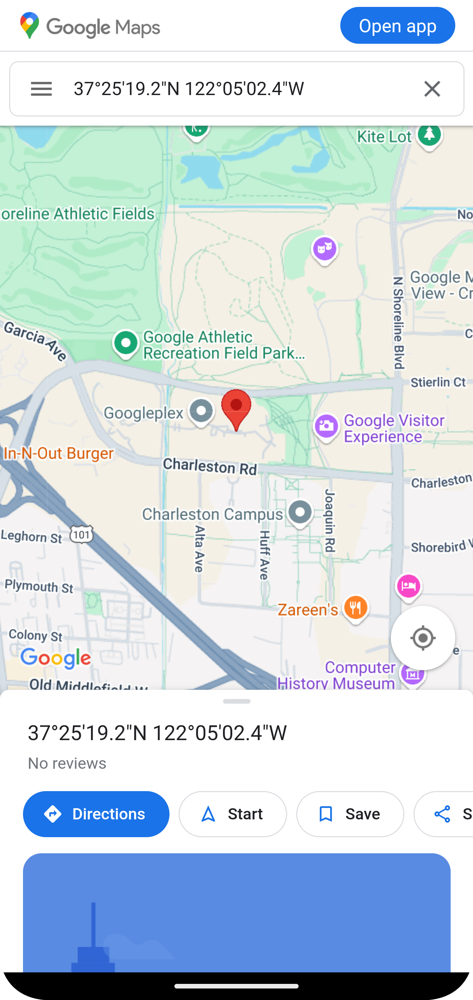

<pre>
██████╗  █████╗ ████████╗██╗   ██╗███╗   ███╗
██╔══██╗██╔══██╗╚══██╔══╝██║   ██║████╗ ████║
██████╔╝███████║   ██║   ██║   ██║██╔████╔██║
██╔═══╝ ██╔══██║   ██║   ██║   ██║██║╚██╔╝██║
██║     ██║  ██║   ██║   ╚██████╔╝██║ ╚═╝ ██║
╚═╝     ╚═╝  ╚═╝   ╚═╝    ╚═════╝ ╚═╝     ╚═╝
</pre>


## 🚀 Overview
PATUM is an AI_Powered application which aims to serve proper justice, public safety, women safety and health safety.Our application features Rapid Response Alert System, Secure and highly encrypted anonymous crime reporting system...

## 📌 Features
- ✅ Rapid Response Alert System
- ✅ Encrypted and Secure Crime Reporting System
- ✅ Anonymous and Privacy ensured crime recording feature
- ✅ More...

## 🖥️ Tech Stack
- **Frontend + Backend:** Flutter, FireBase, Gemini API, Google Maps and Geolocation.

## 📱 Screenshots
<p align="center">
  
  
  
  
</p>

## 🚀 Installation & Setup
### Prerequisites
- Android Studio , Flutter

### Steps
1. Clone the repository:
   ```bash
   git clone https://github.com/yourusername/your-repo.git](https://github.com/Adityavasudev2006/Patum
   ```
2. Navigate to the project directory:
   ```bash
   cd patum_app
   ```
3. Install dependencies:


## 🛠️ Configuration
Android Studio + Flutter

## 📚 Documentation
https://docs.flutter.dev/ <br>
https://dart.dev/

## 👥 Contributors
- Aditya Vasudev K 
- Ananya Vinay
- Mohammed Sofiyan
- Adithyan Ajish

## 🛡️ License
Ownership & Intellectual Property Notice - adityavasudevk@gmail.com <br>
PROPRIETARY NOTICE: This project is the exclusive intellectual property of the repository owner. All rights reserved.
This software, its code, documentation, and associated materials are protected by intellectual property laws. The repository owner retains exclusive ownership and all rights to this project.
Restrictions:<br>

Unauthorized cloning to personal GitHub accounts is strictly prohibited
The project concept, implementation, and intellectual property are the original work of the repository owner
The repository owner has made the primary contributions to this project

Any use, reproduction, or distribution of this project without express written permission from the repository owner may result in legal action. For licensing inquiries or permission requests, please contact the repository owner directly.<br>
© 2025 Repository Owner. All Rights Reserved.<br>
See the [LICENSE](LICENSE) file for details.

## 📬 Contact
For any inquiries, reach out to adityavasudevk@gmail.com or create an issue on GitHub.Linked In : www.linkedin.com/in/aditya-vasudev-k-b80788278

---


